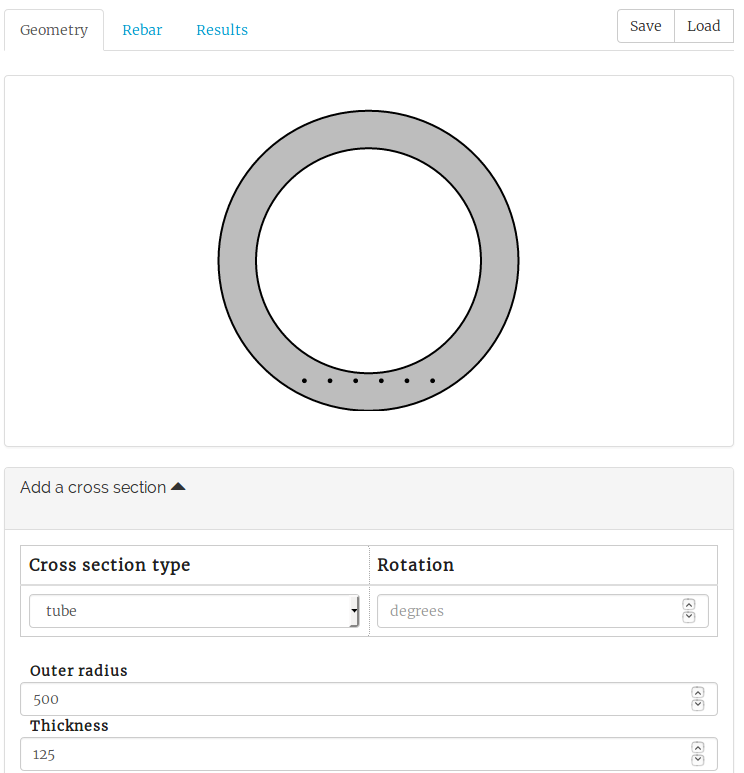
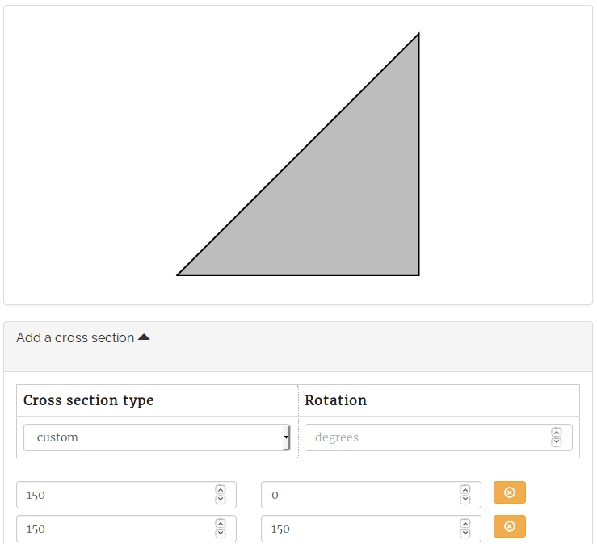

================
Cross sections
================

The input of a new moment curvature analysis starts at the geometry tab.
M-N-Kappa is capable of computing various cross sections. Some cross section types are preset.

* Rectangles
* Tubes
* Circles
* T-beams
* I-beams

If the required cross section is not available you can choose the custom option and insert points 
on a x- and y axis to create a random cross section.

The first coordinate is always set at the origin (0, 0) and the final coordinate is also set to 
this value. This means the polygon closes automatically as shown in the figure below.

